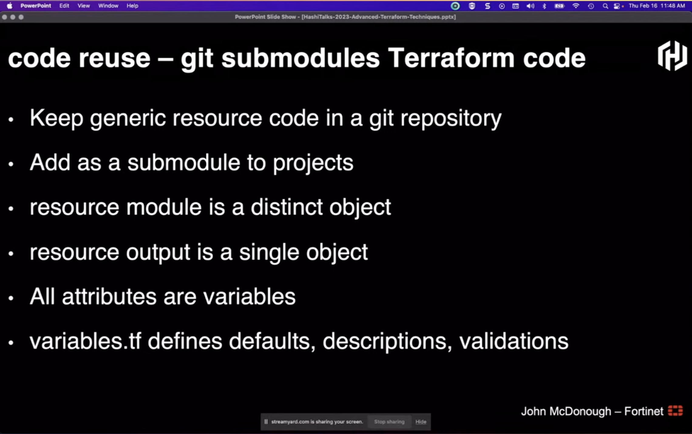
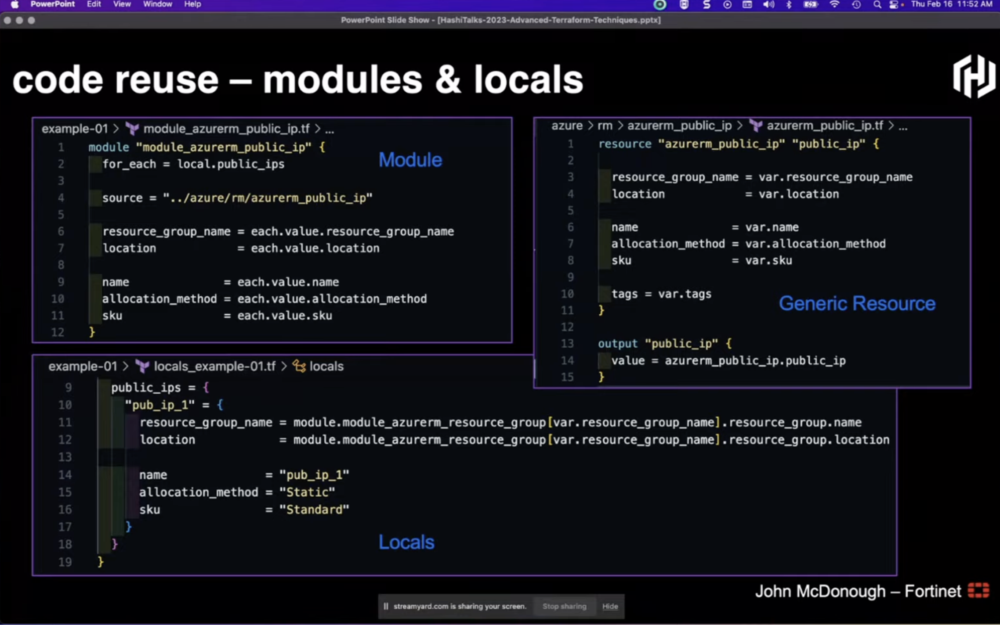
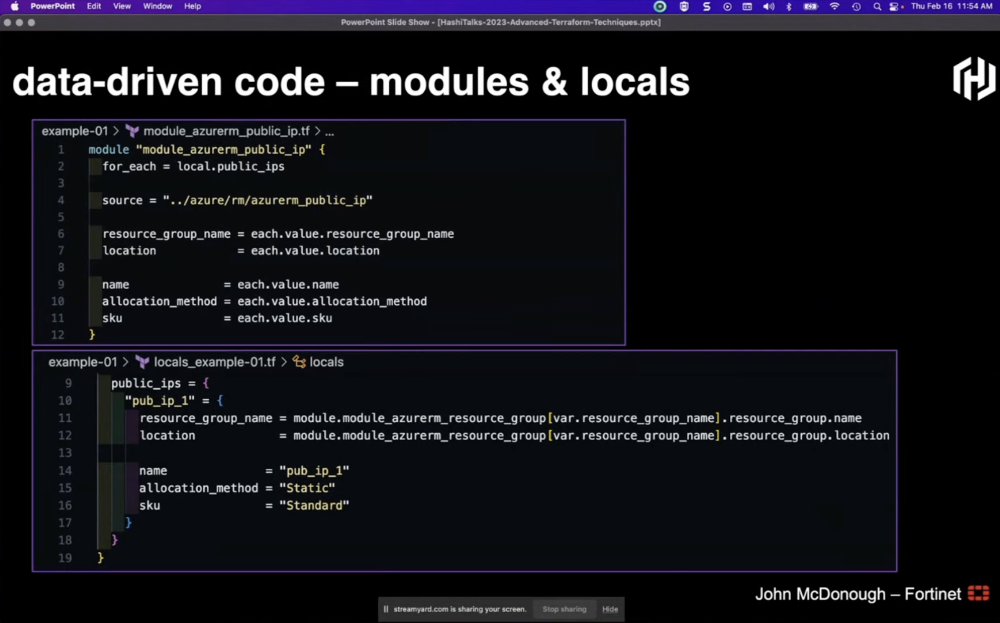
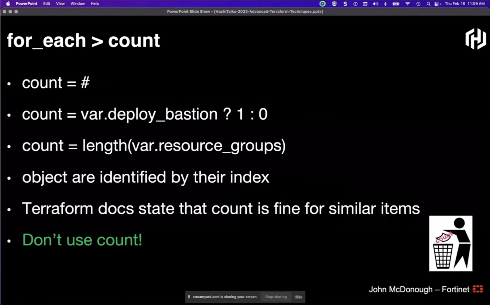
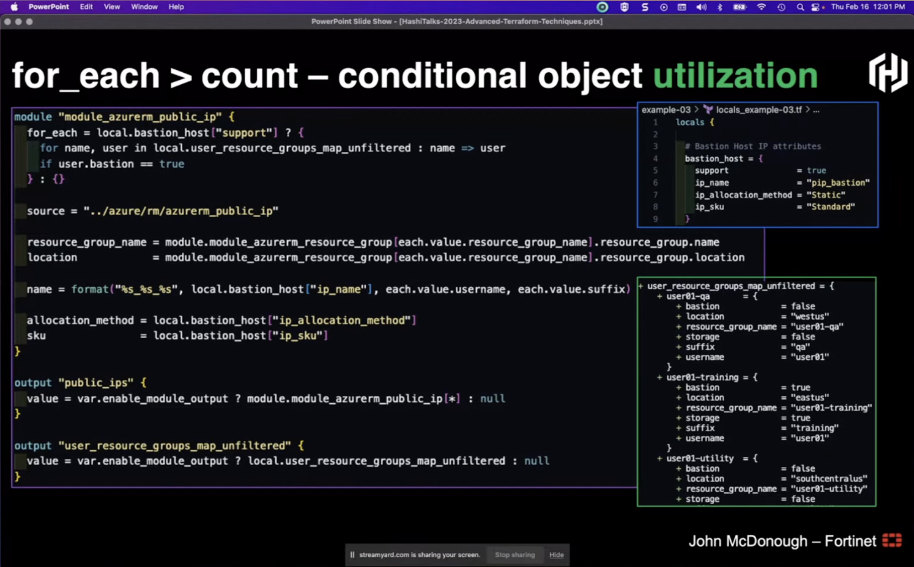

## Advanced Terraform Techniques

`[Terraform]`

Presented by John McDonough

Code Reuse: Git submodules
* Is a regular repository
* Added to the repository as a reference
* Subdirectory one or more level below root

Code Reuse: Terraform modules 
* Generic module + variable file (and maybe some defaults)
* Locals to define actual data that the module (vars) are called with

Data Driven Code:
* Using locals with abstract and generic resources takes away the complexity as it is the only real point of interest (especially for reusing)
* Maps and lists can atomate reoccuring resource creation

Don't use `count`! Use `for_each`!

Further presentation of dynamic block ressources was very hard to follow

Implicit Dependencies:
* Use implicit dependencies where ever possible by referencing the module directly

