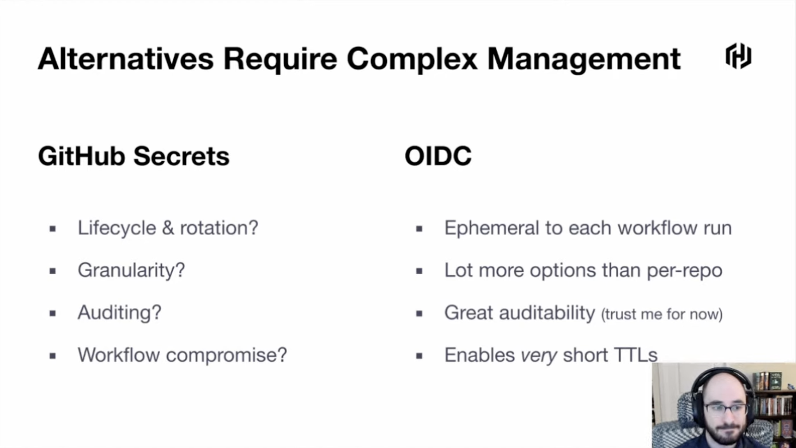
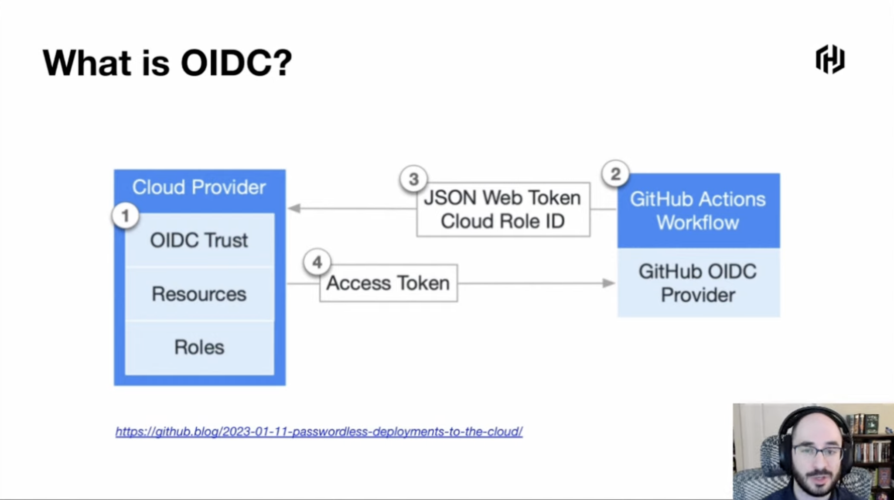
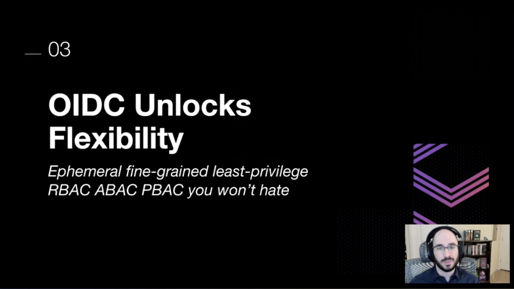
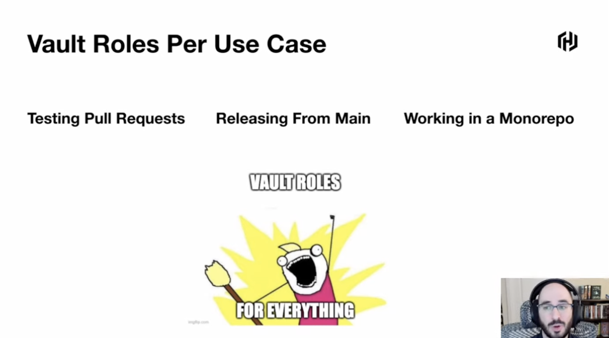
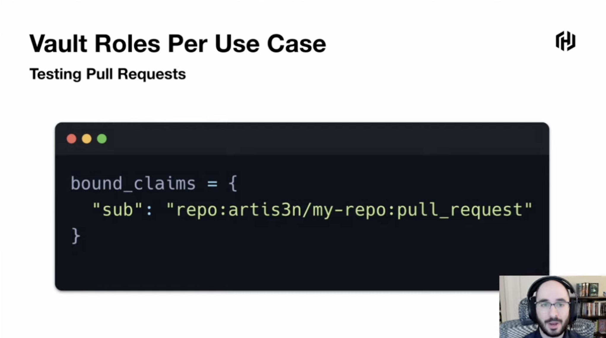
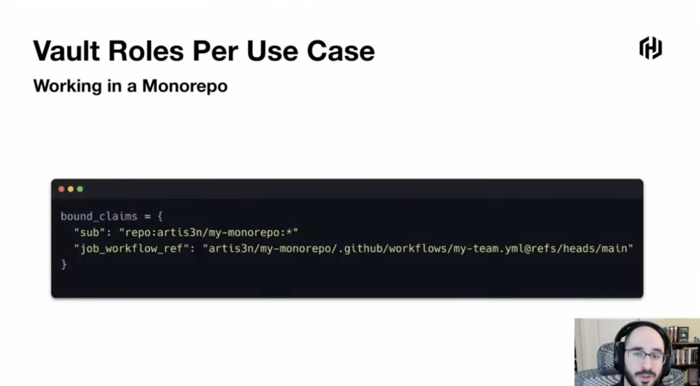
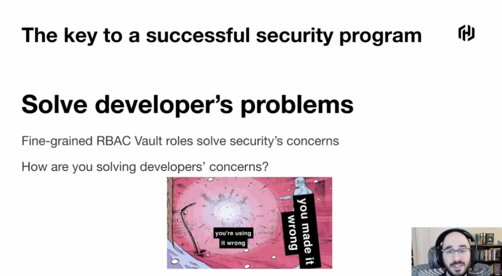
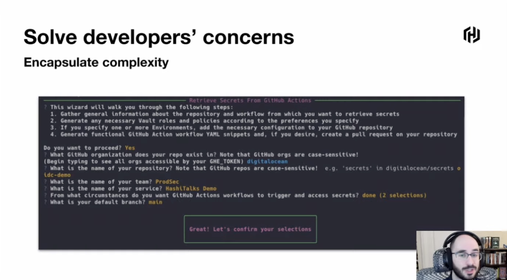
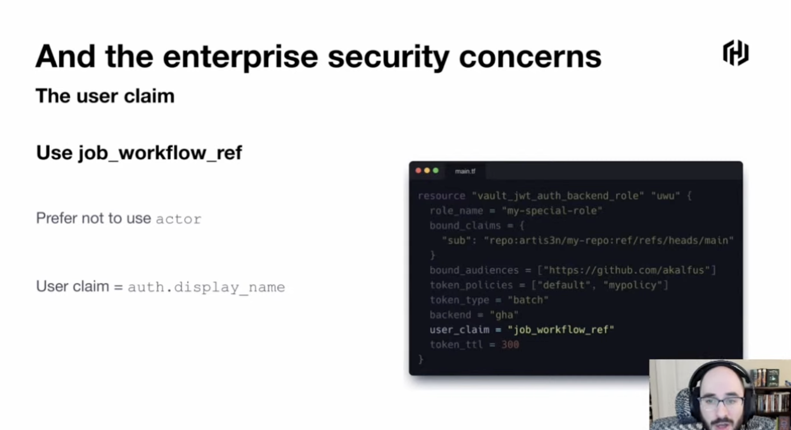
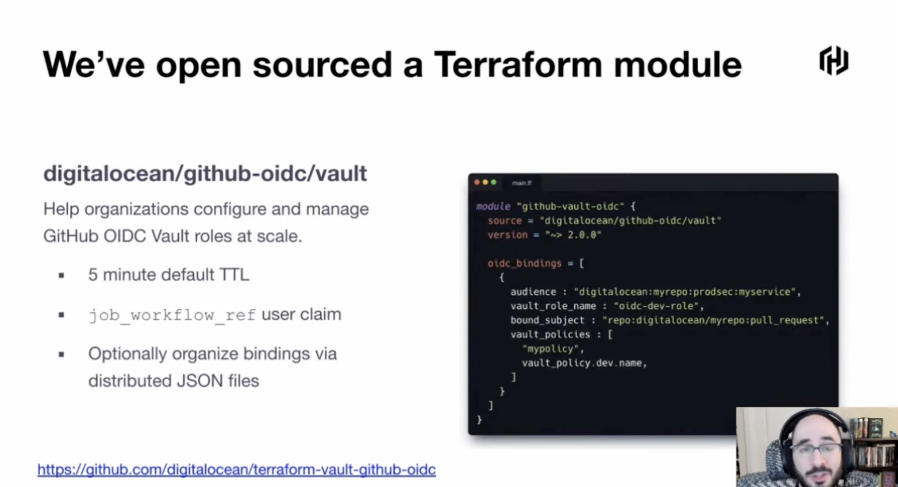

## Building Scalable Enterprise Secrets Management with GitHub OIDC and HashiCorp Vault

`[Vault]`

Presented by Ari Kalfus

Secret management is hard:
* The secret zero problem: Where do you store your secret storage system's login credentials

Goal: Don't wind up on the news
* How do we mitigate catrastrophic impact from compromised environments
* Don't use GitHub secrets for managing secrets
* Use OIDC
  * Ephemeral to each workflow run
  * Lot more options than per-repo
  * Great auditability
  * Enables very short TTLs

What is OIDC:

  
Logging in with GitHub actions: Use `hashicorp/vault-action`

OIDC unlocks flexibility:
* Ephemeral least privilage RBAC, ABAC, PBAC
* Vault roles per use case (this creates a lot of vault roles)

Enterprise Consumability:
* Reduce developer friction (make the secure path the easy path)
* Encapsulate complexity (does every dev need to understand jwt, claims and roles?)
  * At Digital Ocean: Command line wizard to request a new vault role for their projects.
* Oversight and auditing (audit via `aud` claim and `user` claim)

Digital Ocean has open sourced a best-practices Terraform module for GitHub OIDC - Vault integration, hands-on course and soon a in-depth security article on Digital Ocean blog.

