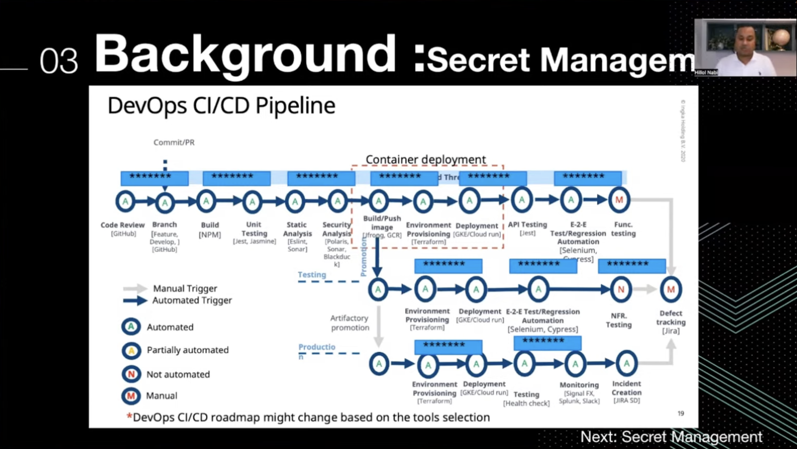
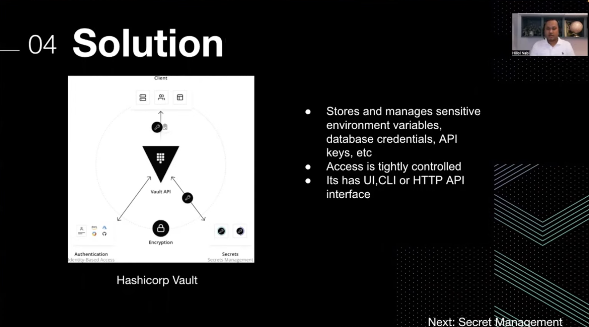
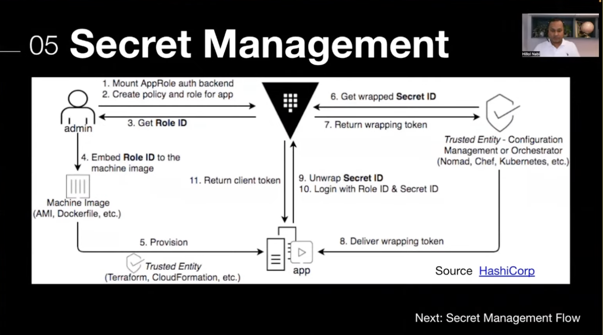
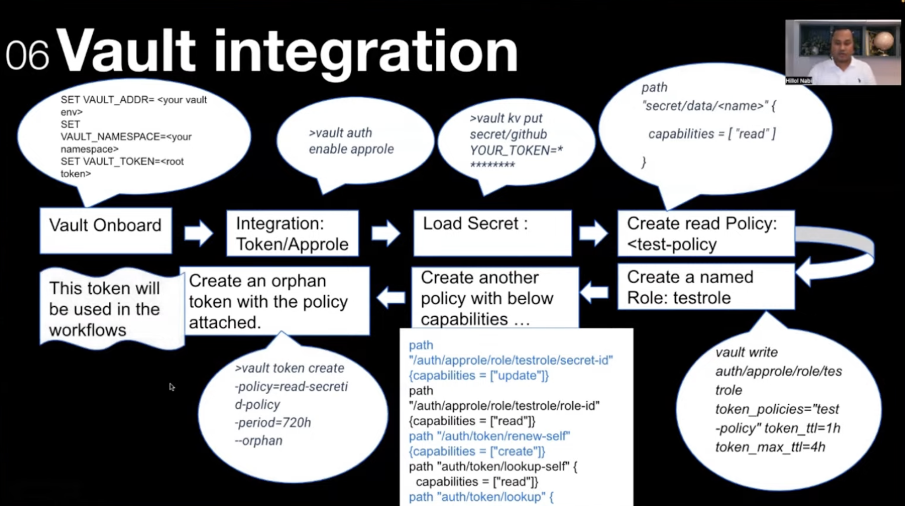
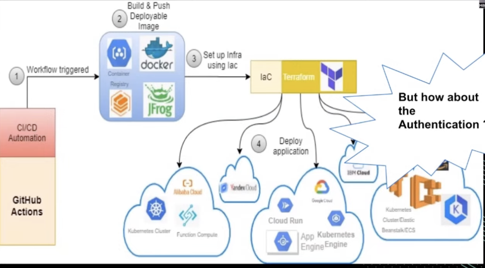
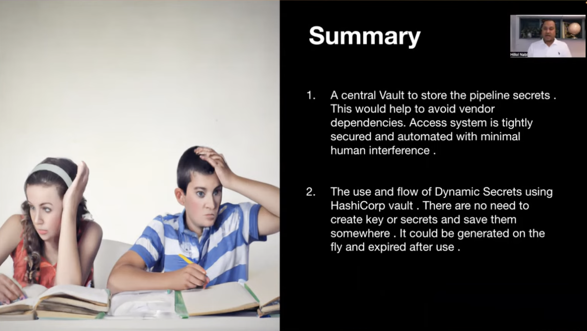

## Building an Agnostic Security Solution with HashiCorp Vault

`[Terraform] | [Vault]`

Presented by Hillol Habib Un Nabi

Key Takeaways:
* Benefits of being agnostic in terms of security
* Managing secretes securely and seamlessly with HashiCorp Vault
* Dynamic Security Key management with HashiCorp Vault

Security agnostic Solution:
* Hence Security agnostic means a solution that is independent and compatible with many vendors in terms of security and authentication.

Why is it needed?
* Service disruption of cloud providers. Ready made solution cannot be ported easily to another provider.
* Pricing of cloud providers is ofter high
* Simplify the solution with one generic solution, rather having multiple slightly different solutions.
* Future Proofing

Background:
* Secrets everywhere in the DevOps CI/CD Pipleline

Solution: HashiCorp Vault
* Stores and manages sensitive environment variables, database credentials, API keys, etc
* Access is tightly controlled
* Its has UI,CLI or HTTP API interface

Vault Integration:

Workflow Management:
* Workflows in main repositories calls common action repo with vault secrets
* GitHub Action builds Python Docker image that then runs a script and provisions all things needed for Vault
* showing some pyhton code...

