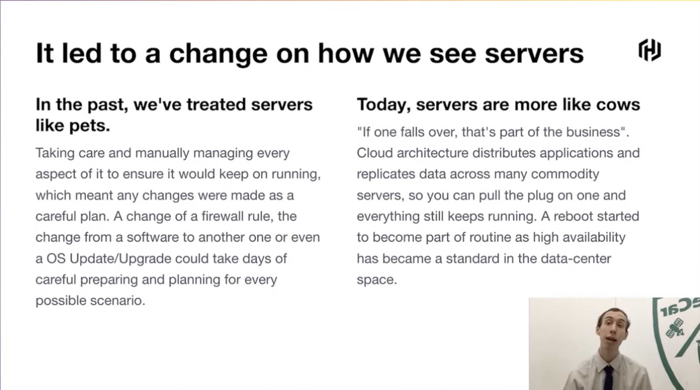
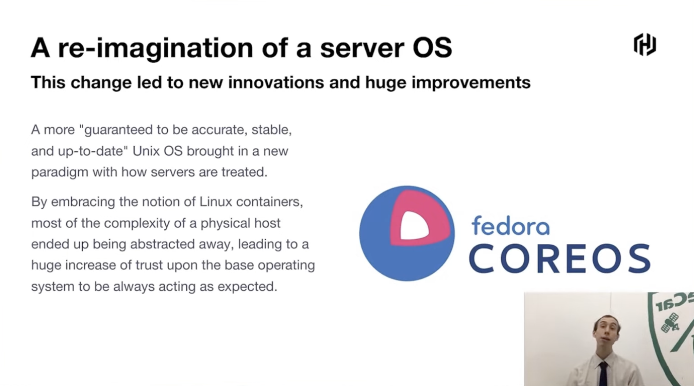
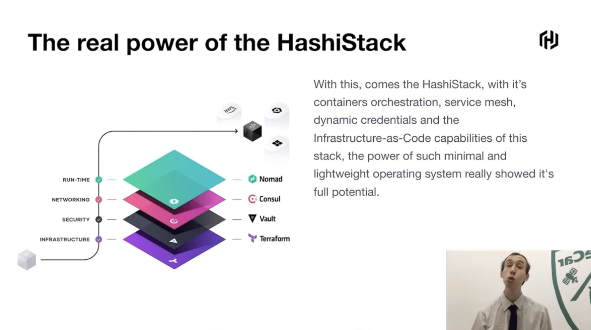
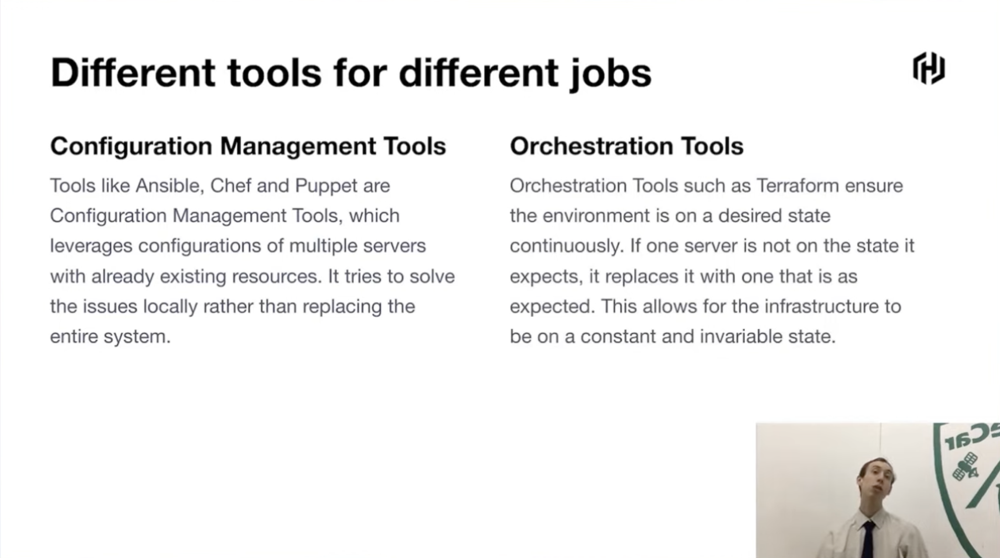
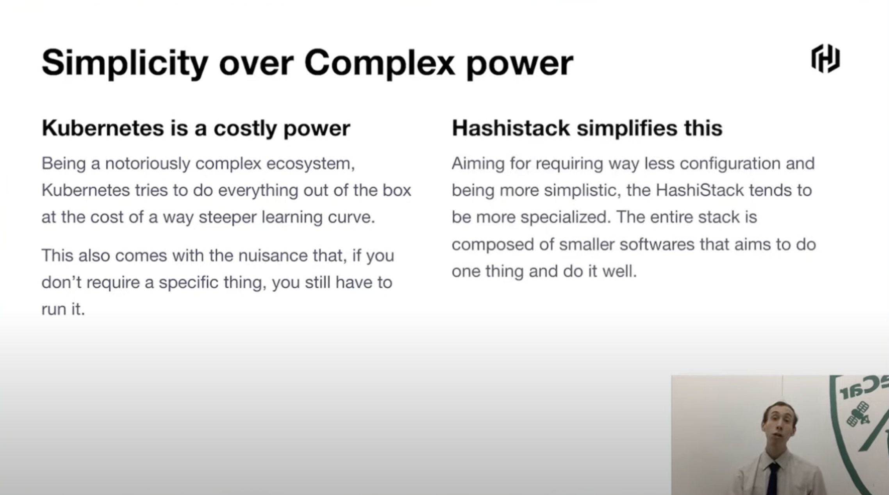

## Containerized Infrastructure-as-Code with Immutable Clusters

`[Consul] | [Nomad] | [Terraform] | [Waypoint]`

Presented by Felipe Angelo Sgarbi

Traditional servers come with many pitfalls and much manual labor.

This led to a new perspective on servers and how to handle them.

Also the server OSs where re-imagined (example Fedora CoreOS).

CoreOS enables simple yaml file configuration, which greatly simplifies and improves the process.

Terraform can also be used with CoreOS to bootstrap a complete HashiStack ready for production:
* Terraform bootstraps the infrastructure with the proper configuration files for CoreS to know how to set-up everything, while CoreOS makes sure to atomically install and configure all the softwares

Few Gotachs with CoreOS:
* Single configuration only
* Persistent storage must be explicitly set up
* Changing the configuration isn't as straightforward after first boot (OSTree atomic updates as remedy)
* Server must reboot to apply updates

Why not the alternatives, such as ansible with common server?
* Different tools for different jobs
* Tools like Ansible, Chef and Puppet are Configuration Management Tools, which leverages configurations of multiple servers with already existing resources.
* Orchestration Tools such as Terraform ensure the environment is on a desired state continuously. If one server is not on the state it expects, it replaces it with one that is as expected.

Simplicity over Complex Power:
* Kubernetes is a costly power: Being a notoriously complex ecosystem,
Kubernetes tries to do everything out of the box at the cost of a way steeper learning curve.
* Hashistack simplifies this: Aiming for requiring way less configuration and being more simplistic, the HashiStack tends to be more specialized.

Immutability and consistency really shines with HashiStack.