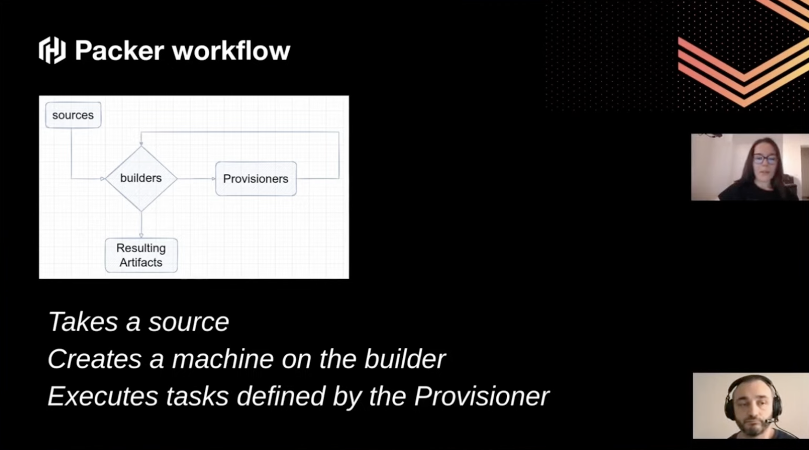

## Exploring and Provisioning Infrastructure with Packer

`[Packer]`

Presented by Andrei Buzoianu & Elif Samedin

What is Packer?
* One of the tools should not be missing from a DevOps Engineer
* Can build images for various platforms as Docker, VM, etc. from one configuration
* Focus on immutable infrastructure
* What does it try to solve?
  * Immutable infrastructure
  * Configuration drift
  * Deployment and Time to Market
  * Control over costs

Golden Images:
* Master Image / Base Image
* Contains software and configuration
* Increaeses image usability
* Avoid manually installing and configuring software

Automation does increase deployment speed and time to market, which in turn reduces costs and increases profitability

Packer Workflow:
* Takes a source
* Creates a machine on the builder
* Executes tasks defined by the Provisioner

Demo ensues...
