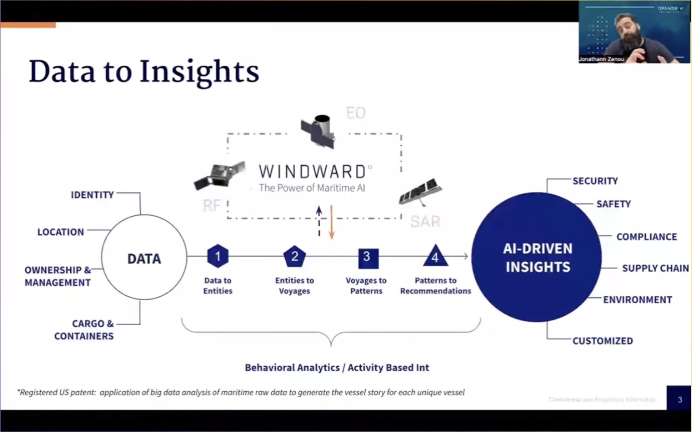
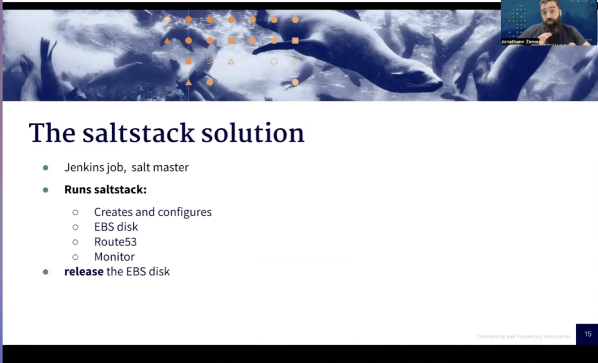
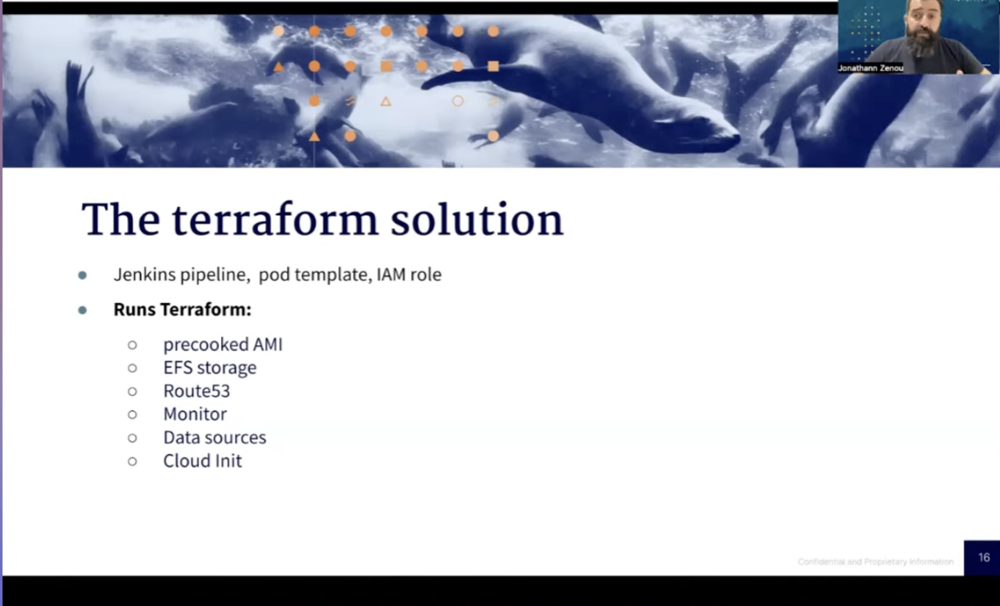

## How Terraform Helps Us Catch Bad Guys at Sea

`[Terraform]`

Presented by Jonathann Zenou

Data and AI based predictions of operational risks for high sea transports.

Before Terraform they used *SaltStack* with a Jenkins Job as a *Salt Master*.

How does it work with Terraform?

Model Creation with several GPU environments:
* Jenkins Pipeline, pod template, IAM Role
* precooked AMI
* EFS Storage
* Route53
* Monitor
* Data Source
* Clout Init

For project creation (as the next step) they used the Terraform official Github provider (can create repos, branches, protections, teams, webhooks). Pitfalls: Creation of many many resources and checking remote state, etc. takes very long for this type of application -> remedy: split up the terraform.

Micro Services & Provision:
* Kubernetes: eks, helm
* Monitoring: Kubernetes
* Autoscaling: Karpenting, Keda.sh 

Pain Points:
* Terraform changes need to be delegated to DevOps Team
* Lots of PRs to review

Conclusion:
* Way more stable with Terraform
* Infrastructure changes can be done faster
* Less copying and code clone (Terraform modules help here)
* Multi region is painless