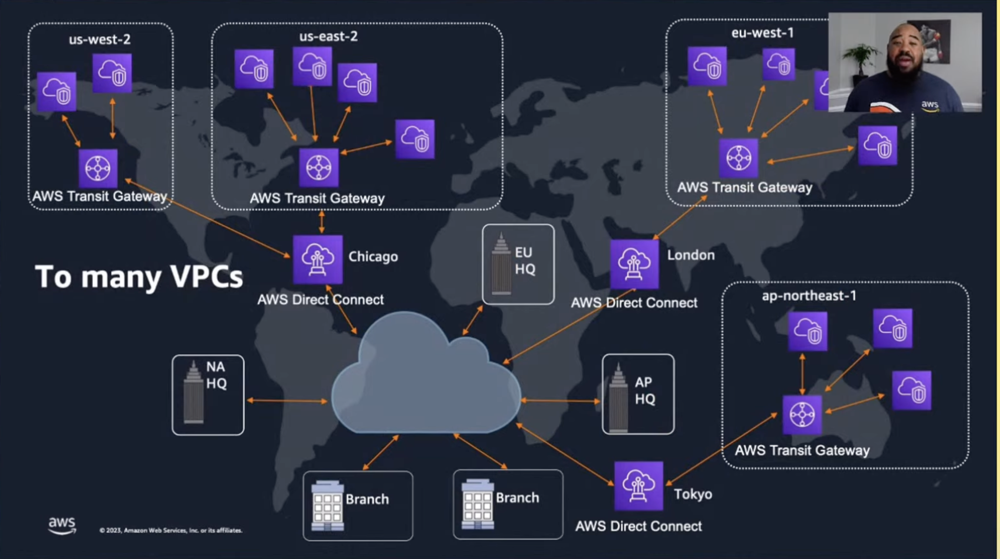
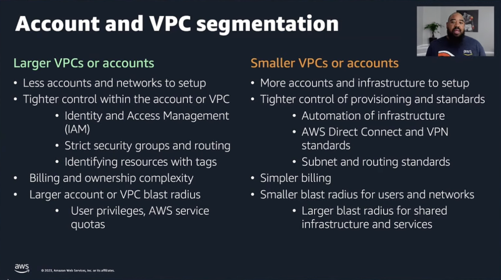
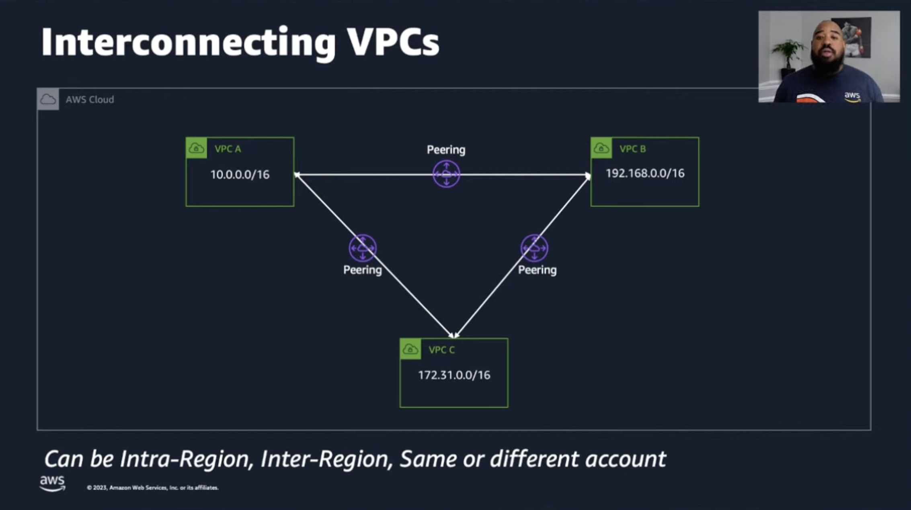
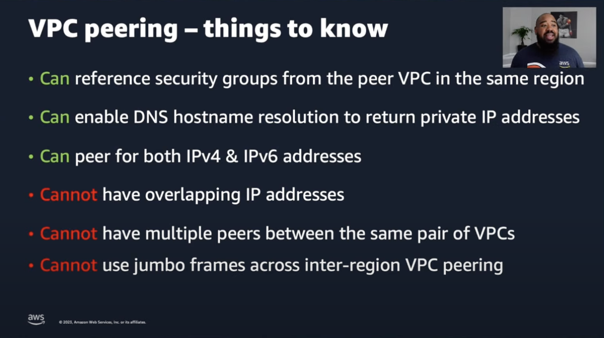
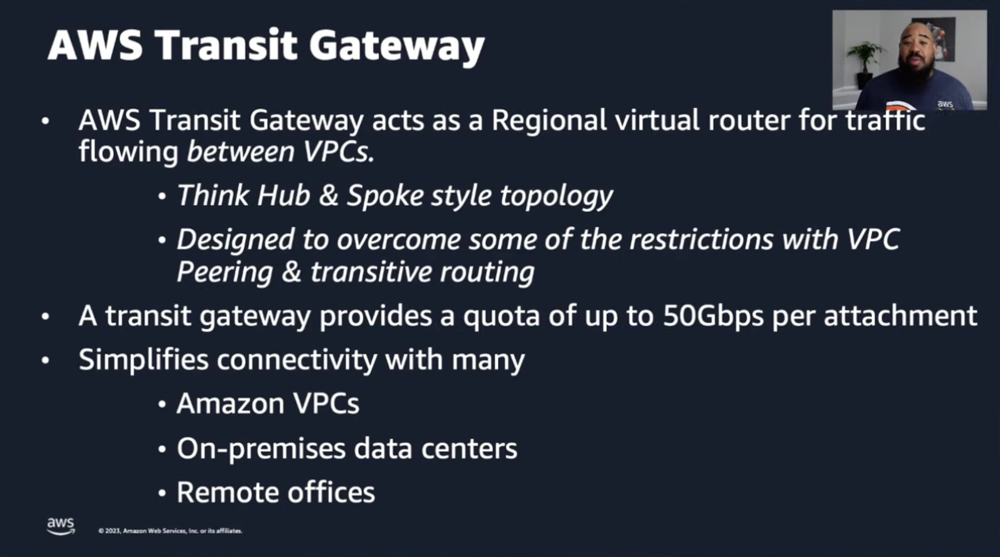
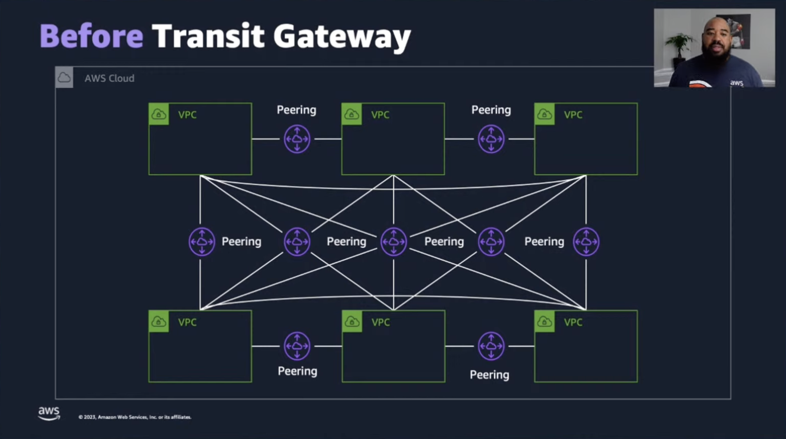
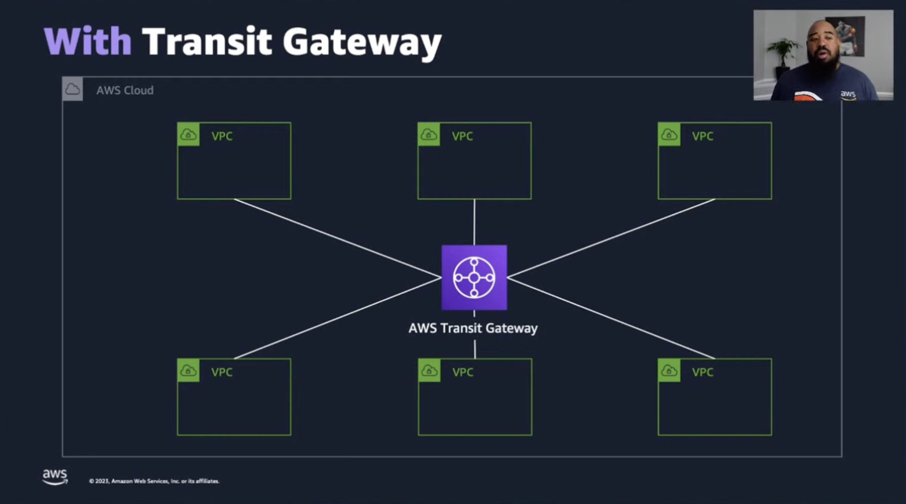

## Scale Your Cloud Network to Infinity and Beyond

`[Terraform]`

Presented by Du'An Lightfoot 

Multi VPC Network Infrastructure:
* VPC is a virtual network very similar to local networks but on AWS infrastructure
* Larger VPCs vs smaller VPCs

VPC Peering:
* Point to point connection between VPCs, works intra network, intra region, same or different account
* Does not support transit routing

AWS Transit Gateway:
* Without you often need a full mesh for many VPCs, making it costly and cumbersome
* Transit gateway can take the role of a switch / router that manages all point to point VPC connections

Terraform Overview:
* AWS provider comes battery included
* VPC ressoures can be created with HCL
* Modules are opinionated grouping of ressources, reusable and flexible

Demo ensues... complete overview of VPC and AWS Transit Gateway with Terraform in AWS Cloud9
