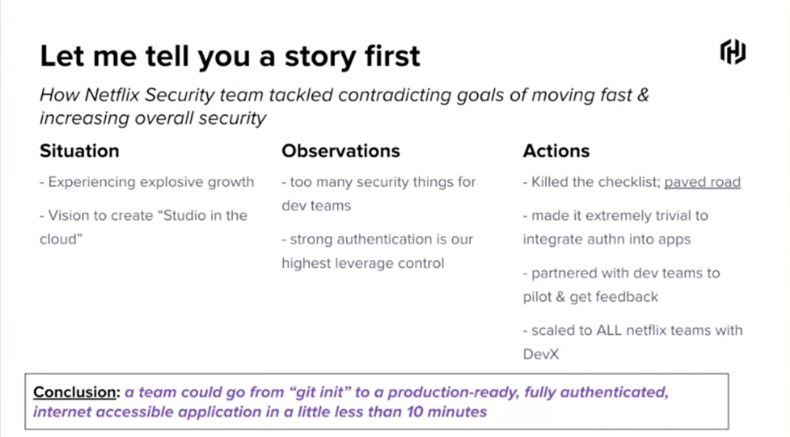
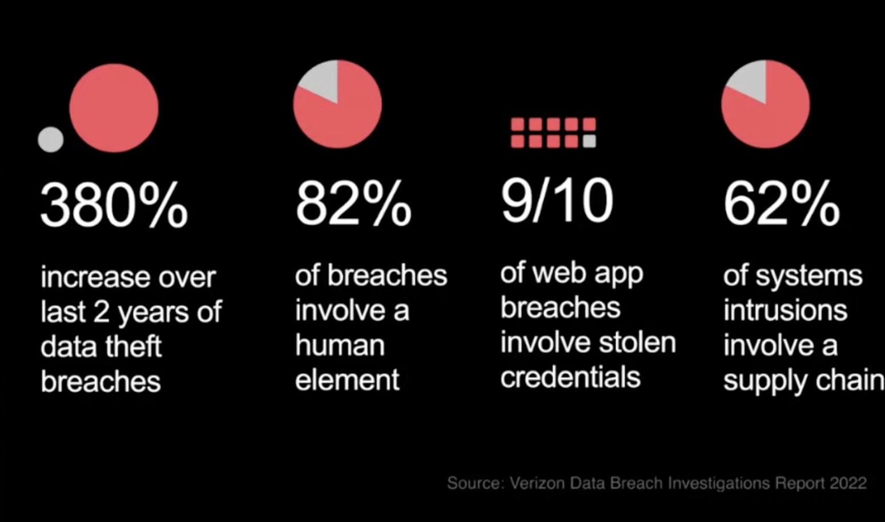
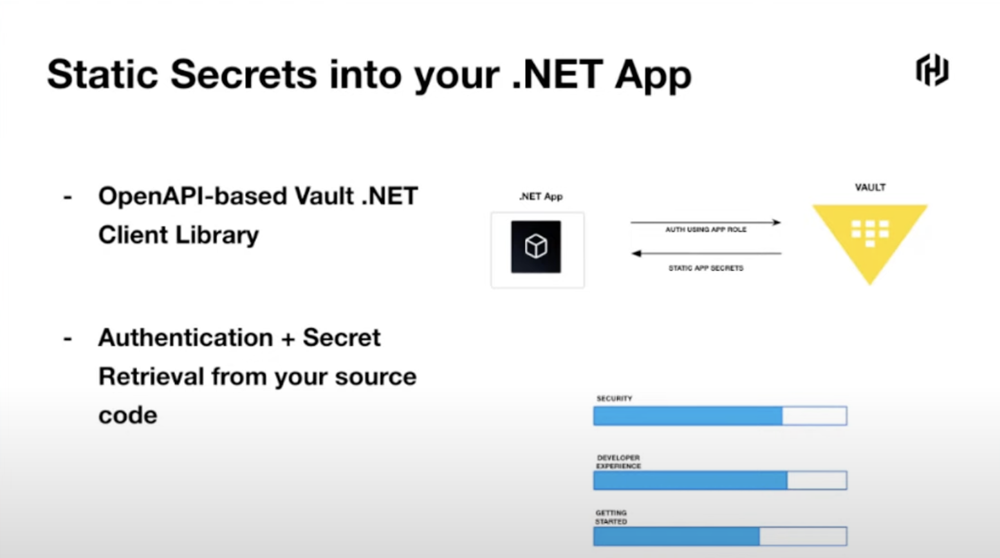
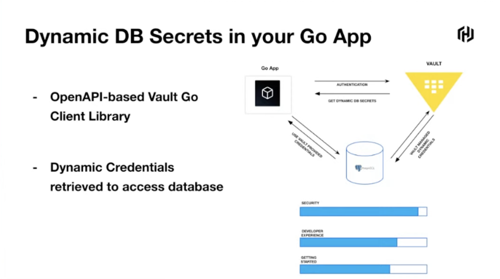

## Secure Developer Workflows with Vault & Github Actions

`[Vault]`

Presented by Kartik Lunkad

Quick Takeaways:
* Security starts at the personal development environment
* Developer experience is the hack to adoption of secure practices
* Start with (just) good enough security is better than no security

Many bad data breaches are suggesting that credentials are the core source of security incidents, therefore secret management is a big focus point here.

Level 1 Secure App Workflow - Static Secrets into .NET App:
* OpenAPI based Vault .NET client library
* Authentication + secret retrieval in source code
* Demo ensues...

Level 2 Secure App Workflow - Dynamic DB Secret in your Go App
* OpenAPI based Vault Go client library
* Dynamic credentials retrieved to access database
* Demo ensues...

Level 3 Secure App Workflow - Secrets in GitHub Action Workflows
* Multiple authentication methods
* Vault GitHub Action to retrieve secrets from Vault
* Demo ensues...

