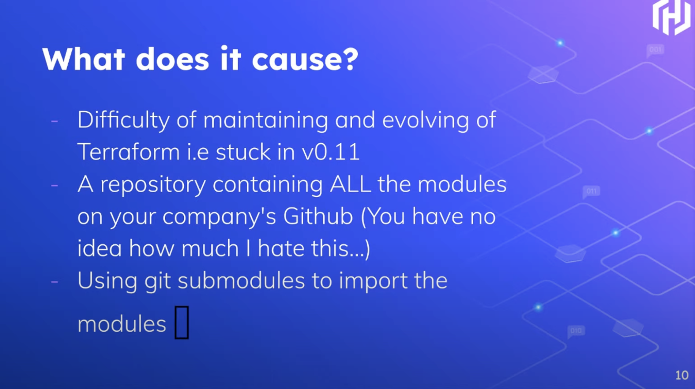
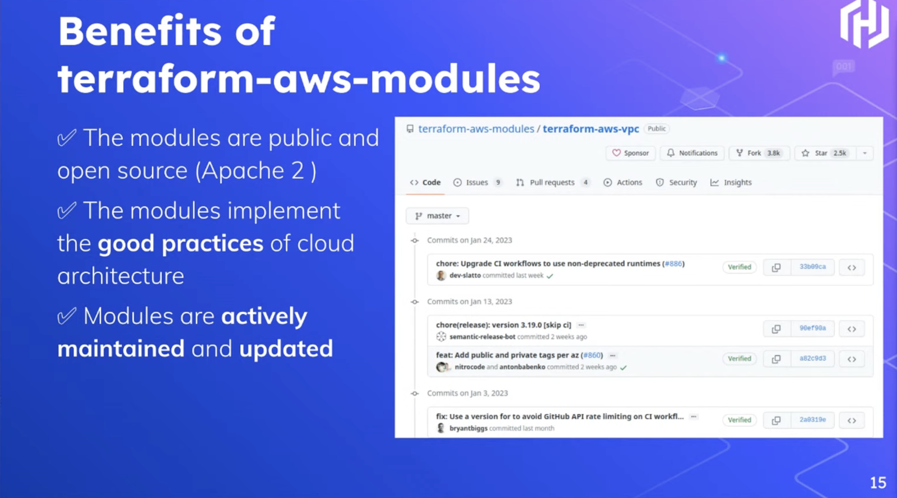
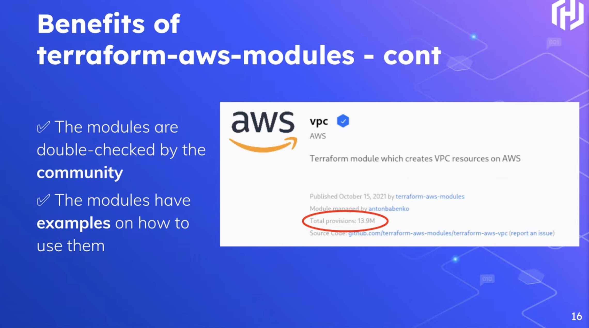

## Terraform: Don't Reinvent the Modules

`[Terraform]`

Presented by Lays Rodrigues

What is Terraform? Quick introduction followed...

Time To Market:
* Plan
* Code
* Build
* Test
* Release
* Deploy

What Companies do:
* Many companies create a private repo with all of the Terraform modules

What Companies should do:
* Use Terraform AWS Modules
* Don't reinvent the wheel

Video of demo ensues showing the usage of AWS VPC module

The main point was that the usage of readily available modules is better since it follows the best practices and saves you from the most common pitfalls.

When should you create your own module?
* Corner cases

Talk was finished short