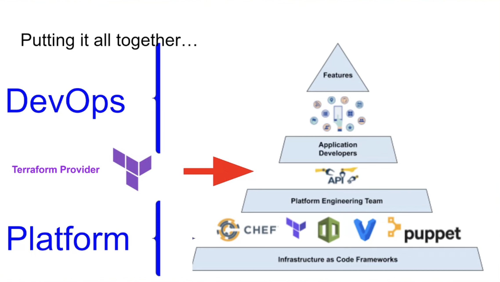

## Terraform for Platform Teams

`[Terraform]`

Presented by Issac Goldstand

Is DevOps dead? DevOps vs Plattform engineering:
* There has been so much effort in including DevOps to Developers, FullStack + Ops = You build it, you own it
  * Much money has also been spent paying those Devs to also include that responsibility
* In a real world that might not work out becuase of security constraints. Some resources / connections / networks can only be created by a designated plattform team in bigger companies
  * Division of resources that can be created / managed by DevOps or Plattform Engineers

Create a REST API to submit request for priviledged ressource creation between Platform Engineers and Devs. How does Terraform fit here?
* A Provider is the glue between the API and the Terraform code
* Creating an own Provider enables you to abstract away the authentication, priviledges access mechanisms and also hide that REST API

Why use a Terraform Provider and not just a module:
* A provider has a several aspects of separation of responsibilities that a module cannot do
* A module is automatically open source, also applies to module nesting. If you want to hide that you need providers, which is distributed in a binary format.
* The state file can be different for providers (The provider can orchestrate much more stuff that is also not bound to Terraform itself)

Do we have a Plattform team?