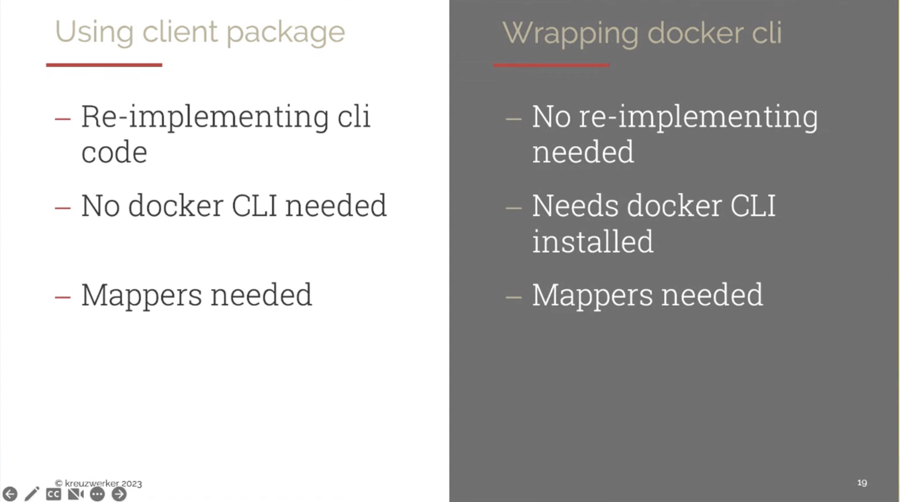

## The Ups and Downs of Maintaining a Terraform (Docker) Provider

`[Terraform]`

Presented by Martin Wentzel

Why do we need a Docker provider?
* Many companies still using on-premise and want to use docker containers IaC

Developing a Provider:
* Docker daemon is the backend
* The Docker provider acts as a client (via Docker client package)
  * This can be used to inspect containers etc.
* ! Versioning issues can appear between backend - frontend
* Why not using the Docker CLI to talk to the daemon: Mostly because of the added dependency (is the client pkg not??)

Testing & CI/CD:
* No need to mock anything because docker daemon are pre installed on github action runners (?)
* Testing with HTTPS, insecure HTTPS and HTTP registries
* Long running tests (14 minutes): Terraform matrix for all the ressources that run about 20 jobs in parallel (brought test time down to 9 minutes) 

Feature Development:
* Support for Podman (not easy, probably only unofficial)
* Support for Docker Compose (in works but very complex)