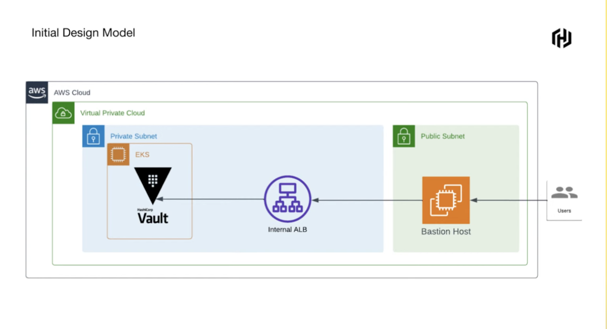
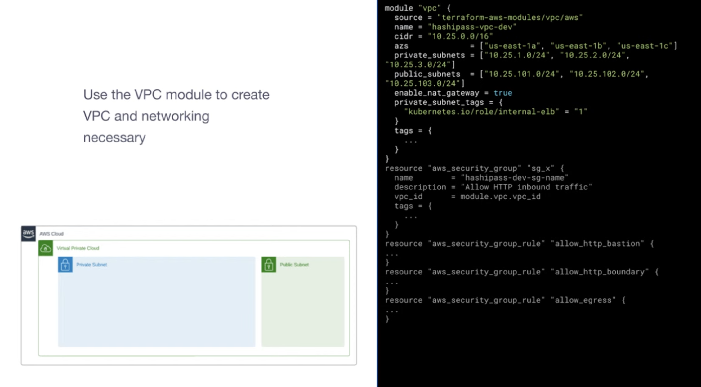
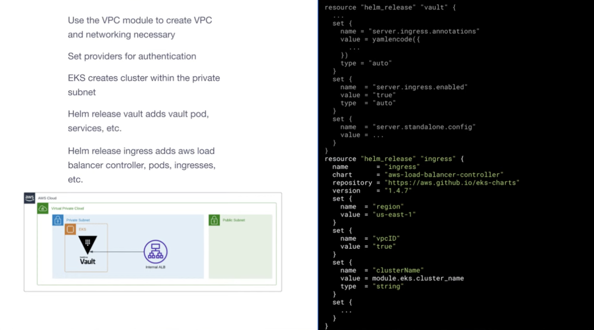
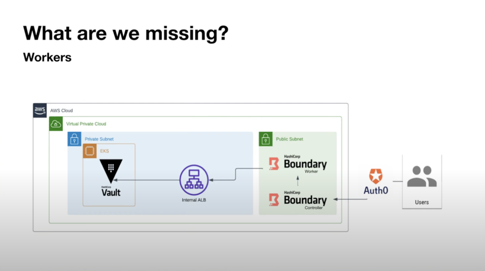
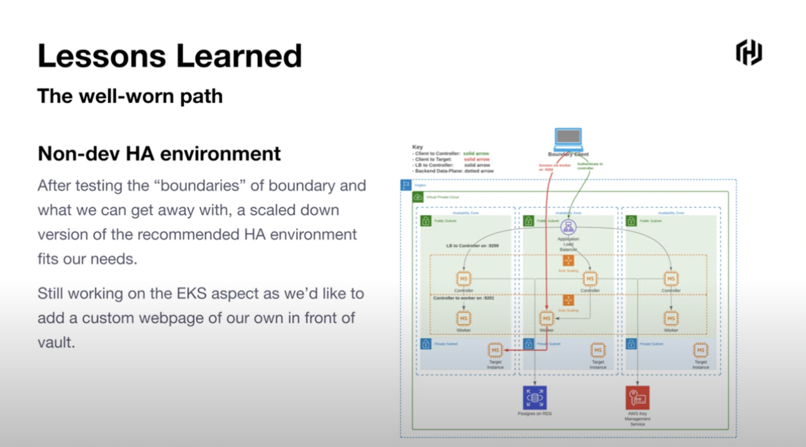
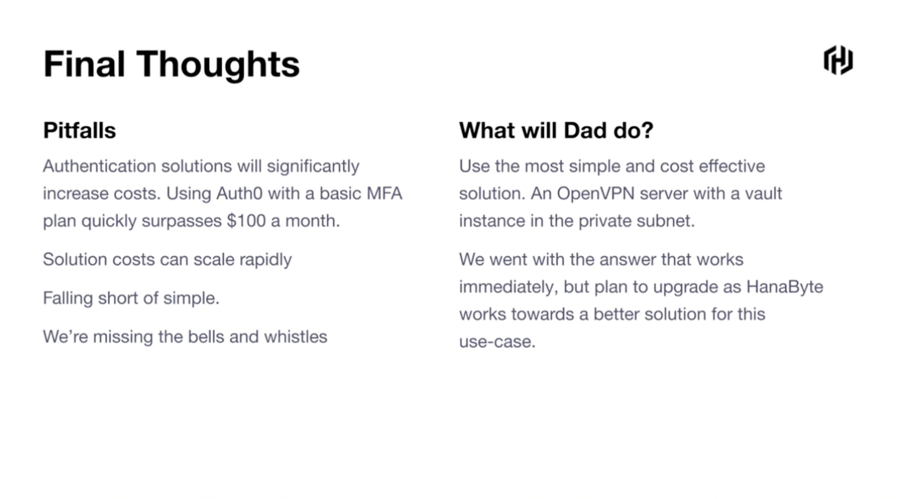

## Vault and Boundary - Managing Secrets at Home

`[Boundary] | [Terraform] | [Vault]`

Presented by Michael Greenlaw

HashiPass:
* Password Manager
* Business use
* At home use
* Cheap
* Simple
* Scalable
* Secure
* Zero Trust

Walktrough of a simple secrets manager implementation. This although is not feasible as it needs a eks setup and quite some implementation

We can subsitute Bastion with Boundary and handle everything in Terraform to make it easier to use and set up.

Further iteration of a "well-worn path" of a high availablility dev environment

