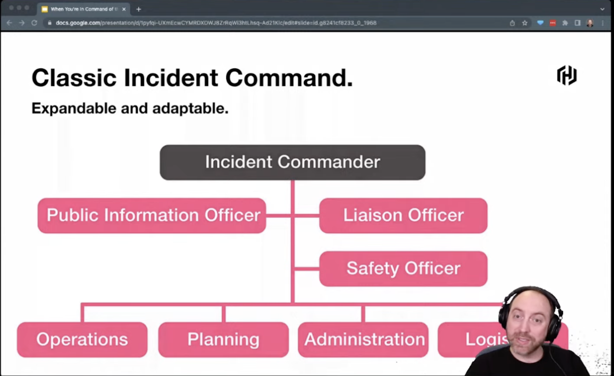
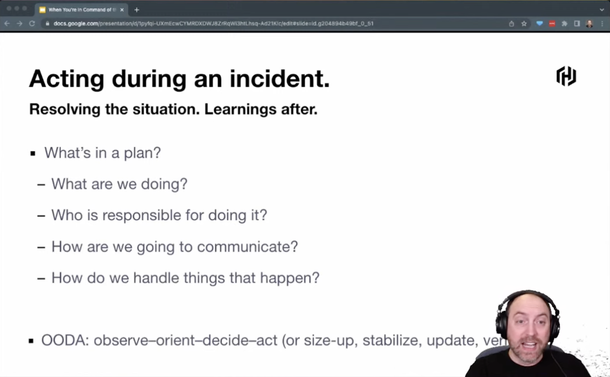
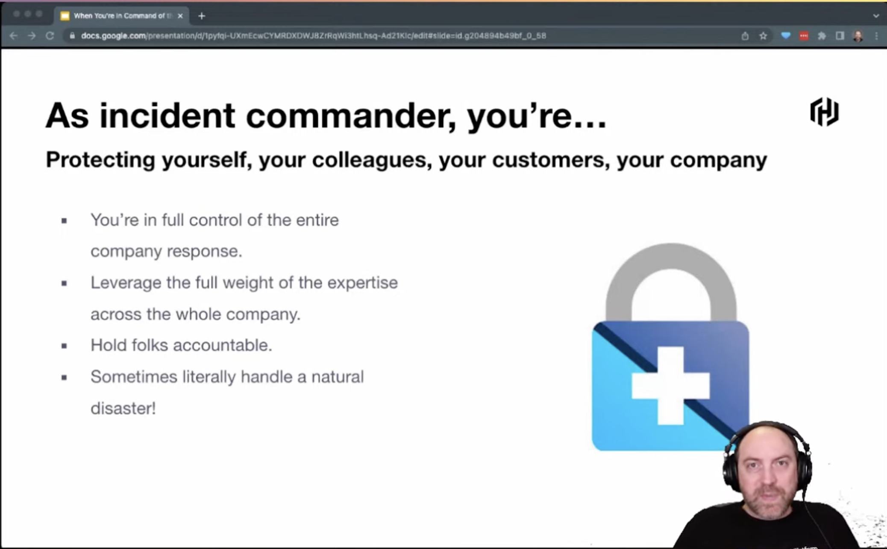
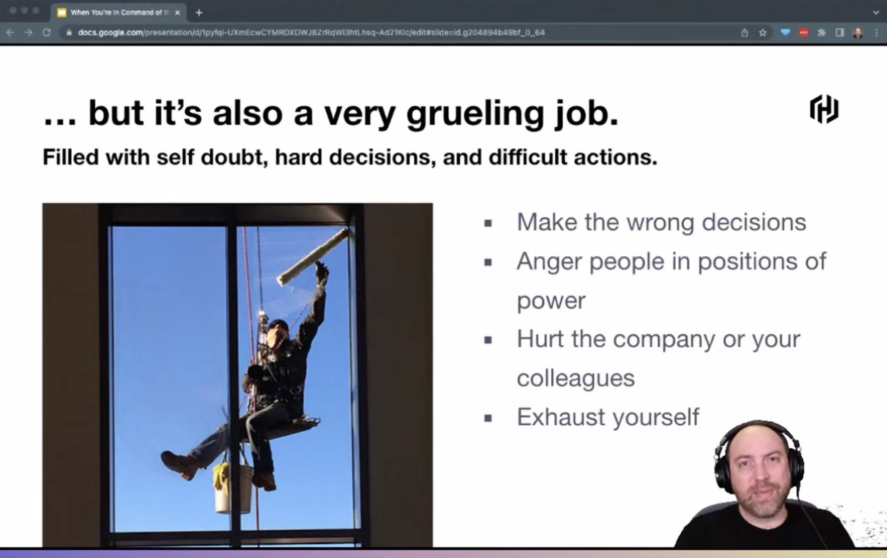
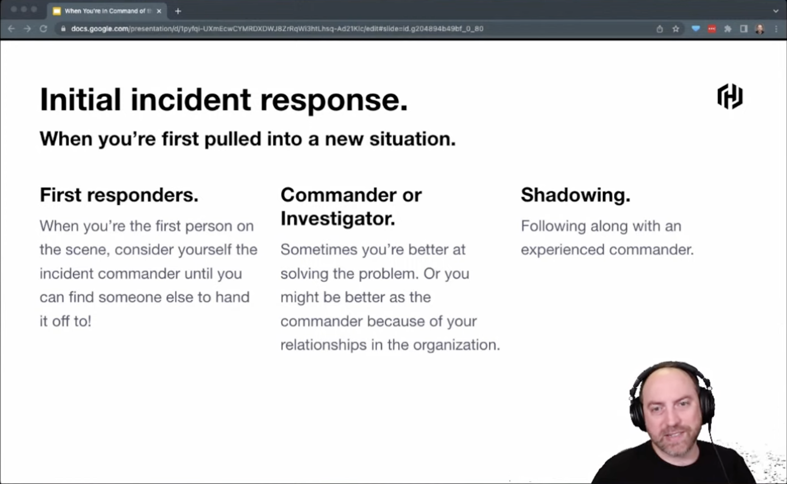
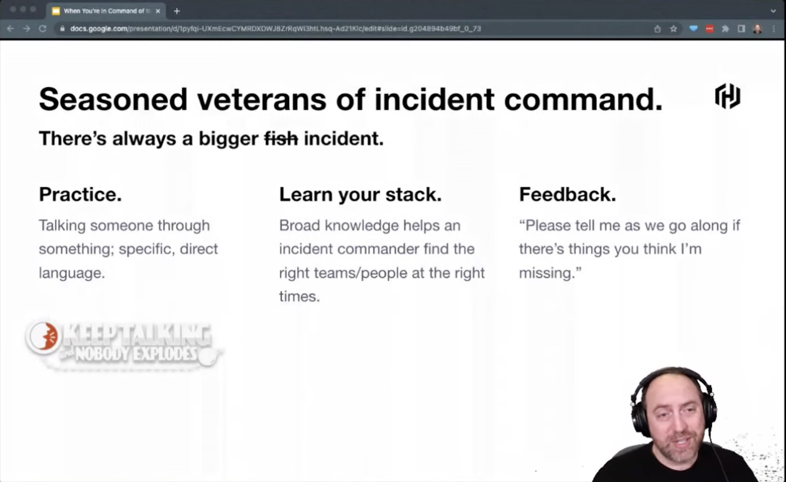
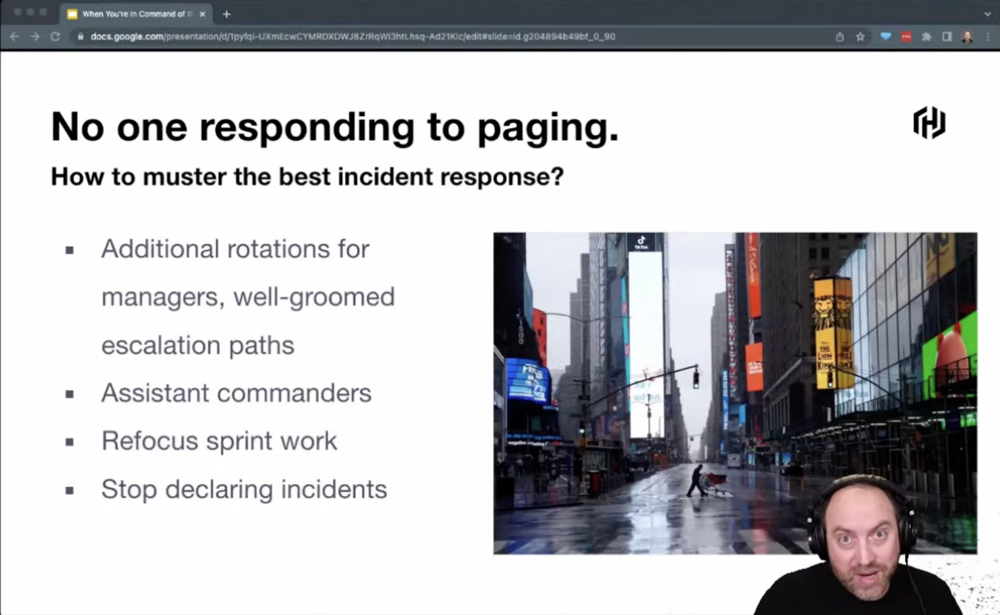
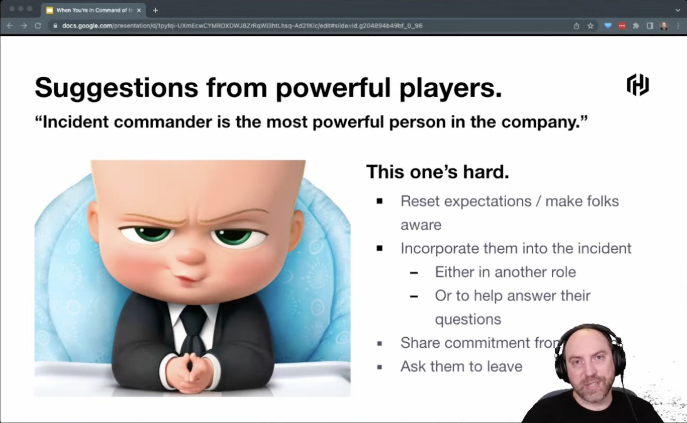
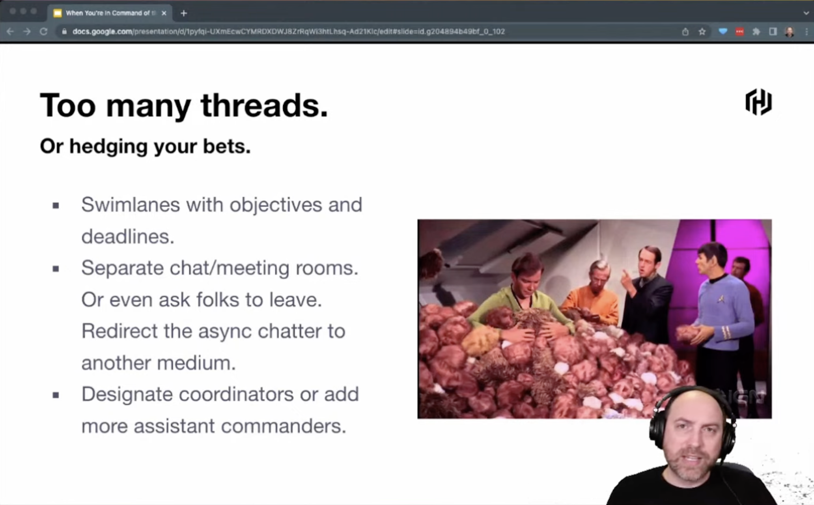
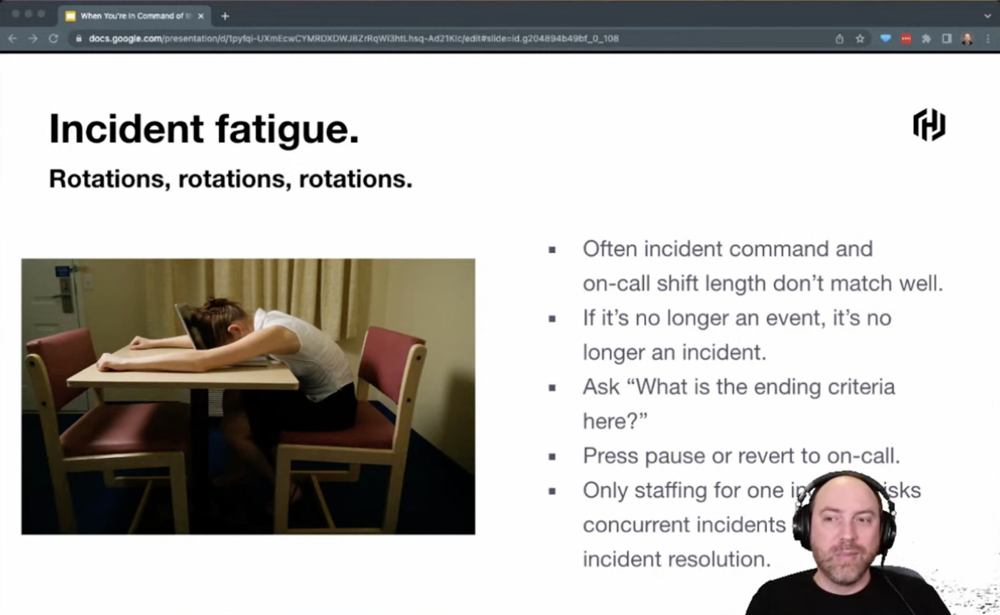

## When You're in Command of the Incident

`[Culture] | [Other]`

Presented by Martin Smith
  
Classic Incident Management: Expandable and adaptable

OODA: observe-orient-decide-act (or size-up, stabilize, update, verify)

Incident Commander is in full control of the entire company response and holds folks responsible

How can we improve the incident command?
* First responders need to consider themselfs as the first incident commander, until you hand it off
* Sometimes you are better at solving the problem, sometimes you might be better as the commander because of you relationships in the organisation
* Shadowing: Follow a more experienced commander / Are you shadow-able when being a experienced commander
* Communication is key, share you thoughts and involve people in the process: Keep talking - nobody explodes. This enables better documentation and knowledge sharing and takes away some stress from the responder as other can chime in and verify
* Retros are a great place to share your doubts as an experienced incident commander

  
Common challanges in incident command:
* No one responds to paging
  * Additional rotations for managers, well groomed escalation paths
  * Assistant Commanders
  * Refocus sprint work
  * Stop declaring incidents (if its happens always, like thats the state of the app just broken)
* Suggestions from powerfull players (like CEO's etc.)
  * Indicent Commander is the most powerful person in the company during the incident
  * This is hard but the commander needs to set the stage and make people aware
  * Incorporate them into the incident
  * Ask them to leave
* Too many threads
  * Swimlanes with objectives and deadlines
  * Seperate chat rooms or even ask folks to leave
  * Redirect async chatter to another medium
  * Designate coordinators or add more assistant commanders
* Incident fatigue
* Too many processes
  * Automate as much as possible

