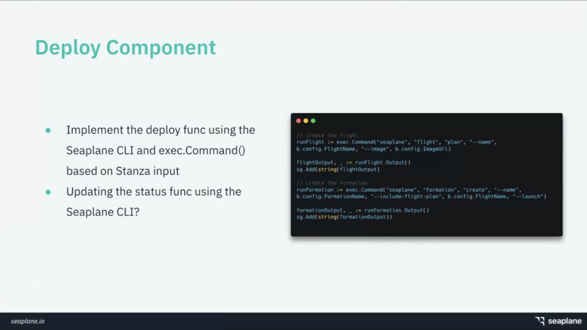

## Writing Your First Waypoint Deploy Plugin

`[Waypoint]`

Presented by Bram Vogelaar & Fokke Dekker

Seaplane is a multi region, multi cloud, edge running serivce provider using waypoint

Waypoint has basic 3 steps:
* Build step (Docker): Build image and push to container registry
* Deploy (Seaplane): Deploys the application and updates the application status
* Release

Waypoint integration framework:
* Has barebone code set up for the 3 basic steps
* Create Waypoint.hcl and validate input
* Build and push image to our registry
* Deploy app to Seaplane 
* Verify the status
* Implement a destroy funtion to take down deployment

Basically an ad on Seaplane and showing how to write some Go module that uses the Seaplane CLI

