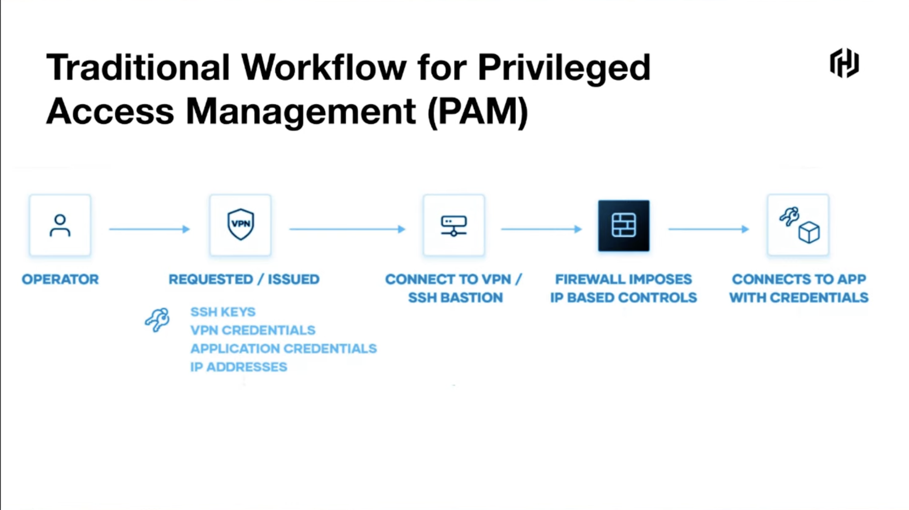
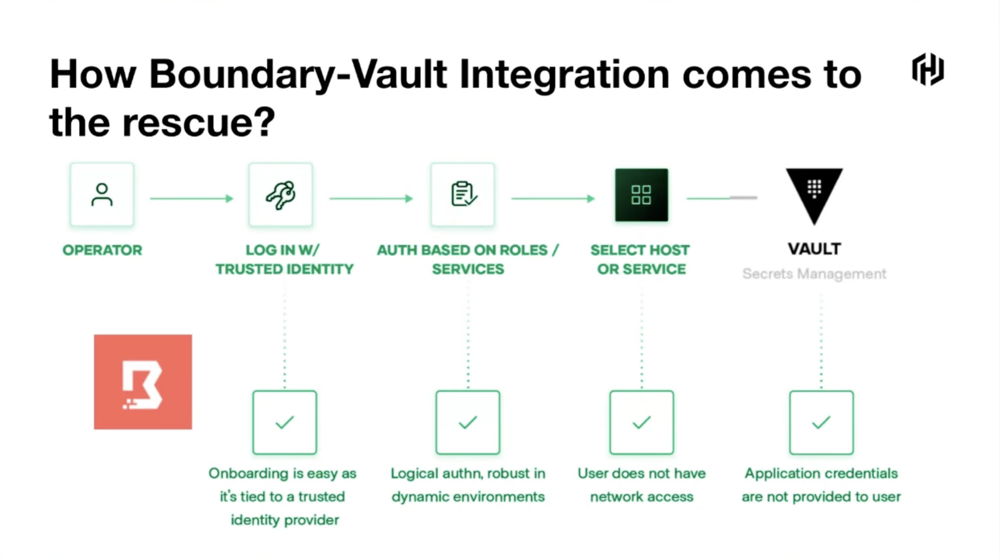
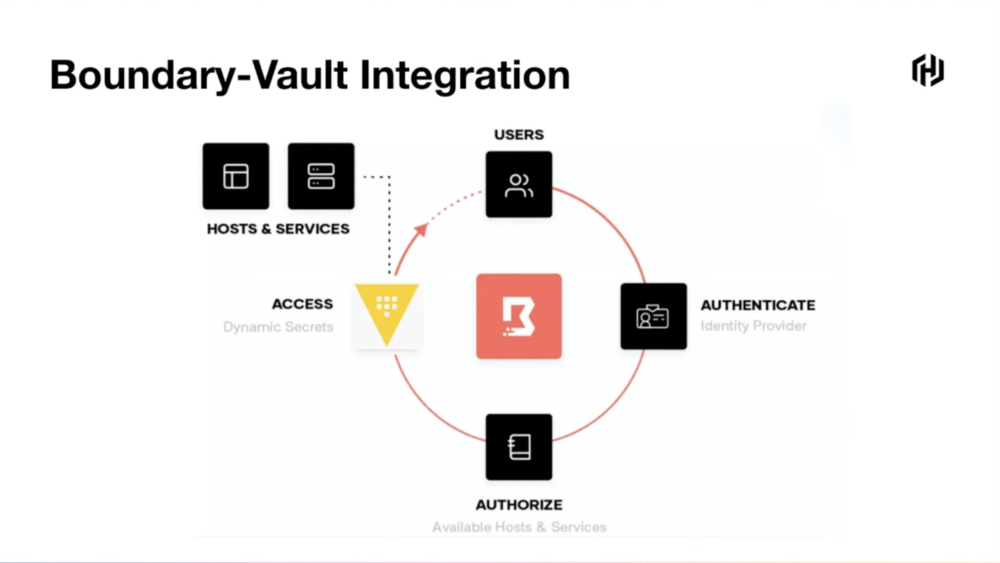
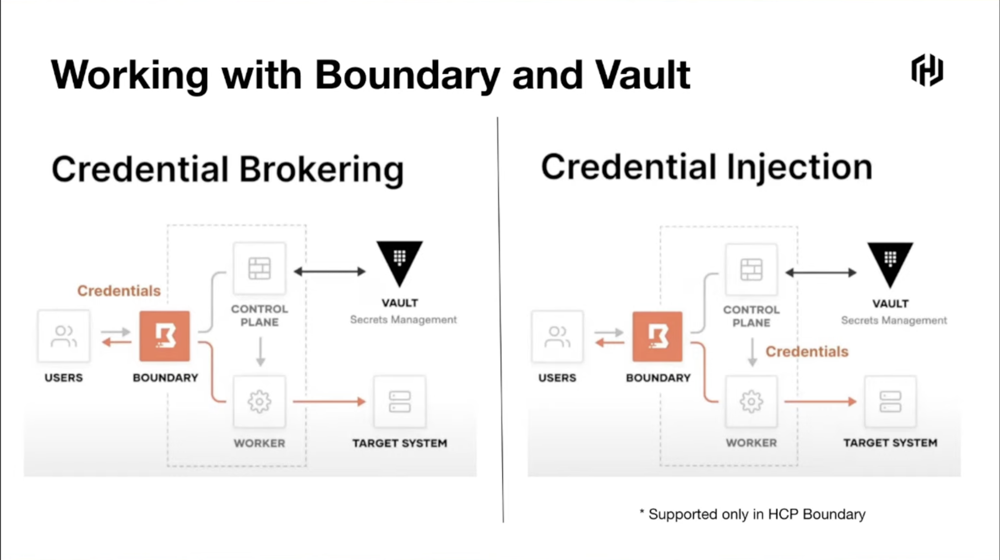
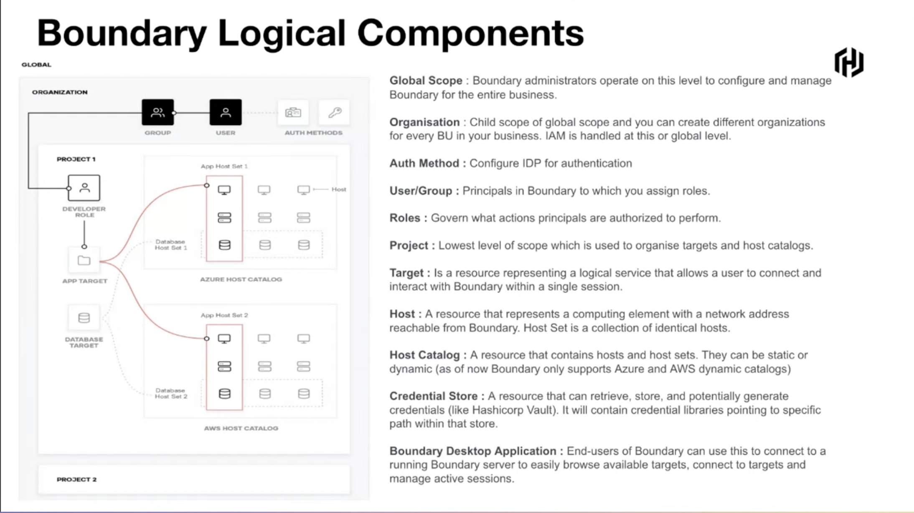
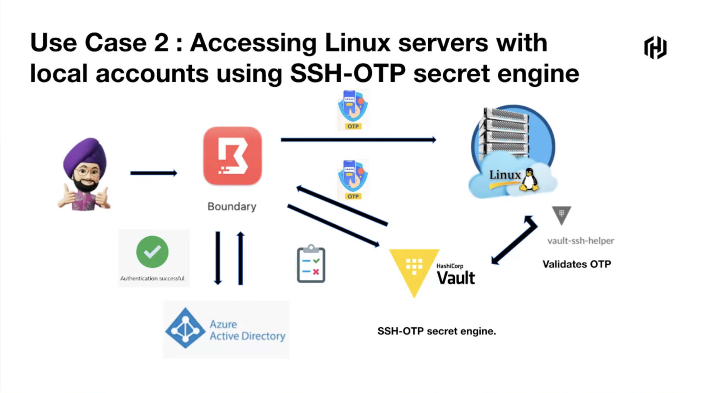

## Zero Trust Security with Boundary and Vault

`[Boundary] | [Vault]`

Presented by Japneet Sahni

Traditional Workflow for Priviledged Access Management:
* Operator SSH Key -> Connect to VPN / Bastion Host -> Firewall / IP based access -> Connects to mostly everything
  * Onboarding is difficult
  * Key rotations are difficult
  * After Bastion Host user has network access, increasing attack surface
  * Managing IPs is brittle in a dynamic environments
  * Application credentials are exposed to the user (such as long lived DB credentials)
* Number of challanges for Zero Trust security approach

How does Boundry-Vault integration comes to the rescue?
* Onboarding is easy as it is connected to an trusted identity provider
* Role based access controls with logic service with tags
* User has no network access but rather a selected host or service (not breaching into the network / zero trust network)
* Vault as secrets management tool can generate dynamic on-demand credentials

There are some paid features (Credential Injection) for Boundary-Vault integration.

Boundary Desktop as a end user solution to connect to Boundary services.

Potential relevant usecase: Accessing Linux servers with local accounts using ssh otp secret engine

Boundary and Vault can be configured in Terraform with HCL.